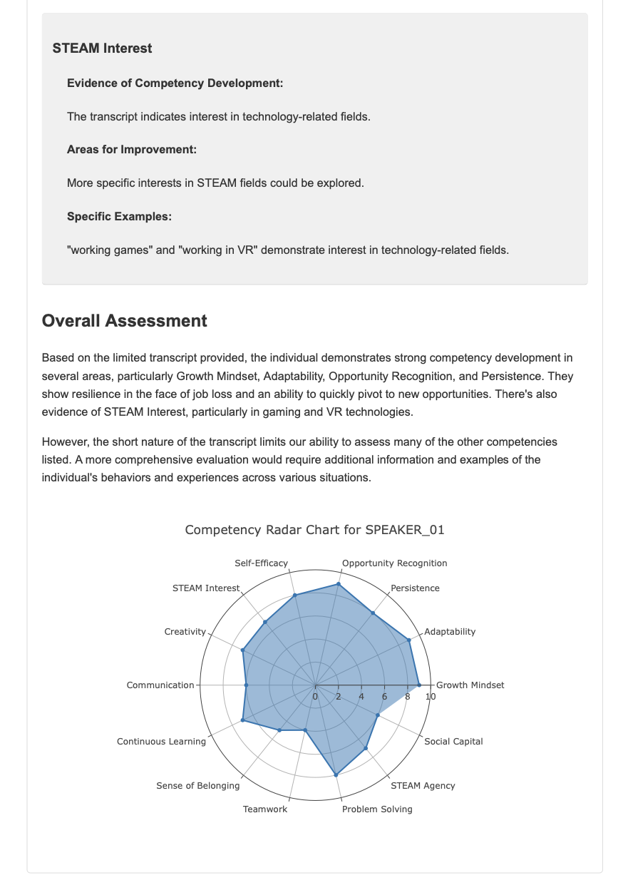

# Competency Extractor

This prototype tool extracts student competency insights from audio recordings of presentations or discussions. It now features a combined mode that provides both narrative and visual outputs, including multi-speaker analysis through diarization and radar graph visualizations.


*Figure 1: General overview of the Competency Extractor in action*

## Prerequisites

- Python 3.7 or higher
- ffmpeg (for audio file conversion)

## Installation

1. Install ffmpeg:
   - Windows: Download from [ffmpeg.org](https://ffmpeg.org/download.html) and add to system PATH.
   - macOS: Use Homebrew: `brew install ffmpeg`
   - Linux: Use your package manager, e.g., `sudo apt-get install ffmpeg`

2. Clone the repository:
   ```bash
   git clone https://github.com/fizt656/compextractor.git
   cd compextractor
   ```

3. Create and activate a virtual environment:
   ```bash
   python -m venv venv
   source venv/bin/activate  # On Windows use `venv\Scripts\activate`
   ```

4. Install required packages:
   ```bash
   pip install -r requirements.txt
   ```

5. Set up API keys:
   ```bash
   cp .env.example .env
   ```
   Edit `.env` with your API keys.

6. Set up Hugging Face:
   - Create an account at [Hugging Face](https://huggingface.co/)
   - Generate an access token in account settings
   - Add to `.env`: `HUGGING_FACE_TOKEN=your_token_here`
   - Run `huggingface-cli login`
   - Accept terms at https://huggingface.co/pyannote/speaker-diarization
   - Run `copy_model_files.py` in the project directory

## Usage

1. Prepare your audio file (MP3, MP4, WAV) and competencies file (text file with definitions).

2. Run the combined script:
   ```bash
   python src/main_combined.py
   ```

3. Enter file names when prompted (audio, competencies, completion sound).

4. The script will process the audio and generate a `combined_report.html` file.

5. Open the HTML file in a web browser to view the comprehensive report.

## Combined Narrative and Data Output

The combined output mode provides both narrative insights and data visualizations in a single report:

1. **Integrated Analysis**: Generates `combined_report.html` containing:
   - Narrative competency insights for each speaker
   - Radar chart visualizations of competency ratings
   - Overall assessment of competencies

   Here are examples of the output you can expect:

   
   *Figure 2: Detailed competency analysis for a specific skill area*

   
   *Figure 3: Overall assessment of competencies across multiple areas*

   
   *Figure 4: Radar chart visualization of competency ratings*

2. **Multi-Speaker Support**: 
   - Automatically performs diarization to identify different speakers
   - Generates separate insights and charts for each speaker
   - Allows easy comparison across speakers

3. **Consistent Speaker Labeling**: Ensures consistency between narrative and visual parts

4. **Structured Data**: Also generates `competency_data.json` with detailed assessments:
   - Competency ratings (0-10 scale)
   - Specific observations from the transcript
   - Areas for improvement
   - Overall assessment

5. **Interactive Visualizations**: Radar charts for each speaker:
   - Display ratings across all competency dimensions
   - Labeled with speaker tags (e.g., SPEAKER_00, SPEAKER_01)
   - Provide intuitive visual representation of strengths and areas for development

## Separate Scripts for Narrative and Data Output

While the combined script is recommended for most use cases, separate scripts for narrative and data output are available and can sometimes yield better results, particularly with multi-speaker inputs:

- For narrative output only:
  ```bash
  python src/main.py [--diarize]
  ```
  Generates `report.html` with transcript and competency insights.

- For data output with radar graphs:
  ```bash
  python src/main_data.py [--diarize] [--visualize]
  ```
  Generates `competency_data.json` and individual radar chart HTML files.

Use the `--diarize` flag for multi-speaker analysis and `--visualize` for radar charts (where applicable).

## Example Files and Testing

Example files for testing:
- `test.wav`: Short sample audio
- `test.txt`: Sample competencies file
- `longer_test.wav`: Longer sample audio
- `multi-speaker-discussion.wav`: Sample for testing diarization

To test:
1. Activate your virtual environment.
2. Run: `python src/main_combined.py`
3. When prompted, enter:
   - Audio file: `test.wav`, `longer_test.wav`, or `multi-speaker-discussion.wav`
   - Competencies file: `test.txt`
   - Sound file: `sound.mp3`

## Additional Stuff

- **Large File Handling**: Automatically splits large audio files into smaller chunks for processing.
- **Multi-Speaker Support**: Identifies different speakers and provides speaker-specific analysis.

## Notes and Recommendations

- Customize system prompts in script files to suit specific needs.
- Experiment with different ways of querying the competencies file.
- Change LLMs by editing your environment. Recommended:
  ```
  anthropic/claude-3.5-sonnet
  ```
  or
  ```
  cohere/command-r-plus-08-2024
  ```

## Future Improvements

- Batch processing for multiple audio files
- User-friendly GUI
- Improved diarization accuracy
- Enhanced visualization options
- Comparative analysis features for multi-speaker recordings
- Customizable report formats

Other Ideas? \\m//